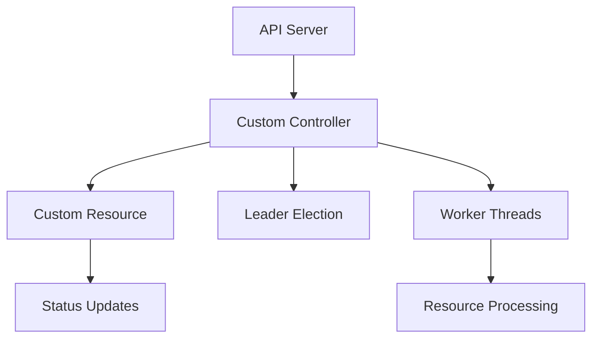

# Kubernetes Custom Controller Helm Chart 🚀

A production-ready Helm chart for deploying custom Kubernetes controllers with aggregated APIs and CRDs. This template provides a robust foundation for building control plane extensions.

[](https://opensource.org/licenses/MIT)
[](https://helm.sh)
[](https://kubernetes.io)

## 🎯 Features

- **Custom Resource Definitions (CRDs)**
  - Extensible CRD framework
  - Schema validation
  - Status subresource support
  - Additional printer columns

- **Controller Configuration**
  - Configurable worker threads
  - Customizable resync periods
  - Flexible logging levels
  - Resource quotas and limits

- **High Availability**
  - Leader election support
  - Configurable lease durations
  - Multiple replica support
  - Pod disruption budgets

- **Security**
  - Pre-configured RBAC roles
  - Service account integration
  - Security context settings
  - Network policies

## 📋 Prerequisites

- Kubernetes cluster v1.16+
- Helm v3.0+
- kubectl configured to communicate with your cluster

## 🚀 Quick Start

1. **Add the Helm repository**
   ```bash
   helm repo add custom-controller https://github.com/yashodhan271/k8s-custom-controller-helm
   helm repo update
   ```

2. **Install the chart**
   ```bash
   helm install my-controller custom-controller/k8s-custom-controller
   ```

## ⚙️ Configuration

### Basic Configuration
```yaml
# values.yaml
replicaCount: 2
image:
  repository: your-registry/custom-controller
  tag: v1.0.0

controller:
  logLevel: info
  workers: 4
  resyncPeriod: 30
```

### Advanced Settings

#### High Availability
```yaml
controller:
  leaderElection:
    enabled: true
    leaseDuration: 15
    renewDeadline: 10
    retryPeriod: 2
```

#### Resource Management
```yaml
resources:
  limits:
    cpu: 1000m
    memory: 1Gi
  requests:
    cpu: 500m
    memory: 512Mi
```

## 📊 Architecture



## 🔍 Monitoring

The controller exposes the following metrics:
- Controller reconciliation latency
- Custom resource processing time
- Error rates and types
- Queue depth and processing stats

Metrics are available at `/metrics` endpoint in Prometheus format.

## 🛠️ Development

### Building the Controller

```bash
# Build the controller image
docker build -t custom-controller:latest .

# Push to your registry
docker push your-registry/custom-controller:latest
```

### Running Tests

```bash
# Run unit tests
go test ./...

# Run integration tests
make integration-test
```

## 🤝 Contributing

1. Fork the repository
2. Create your feature branch (`git checkout -b feature/amazing-feature`)
3. Commit your changes (`git commit -m 'Add amazing feature'`)
4. Push to the branch (`git push origin feature/amazing-feature`)
5. Open a Pull Request

## 📝 License

This project is licensed under the MIT License - see the [LICENSE](LICENSE) file for details.

## 📧 Contact

Yashodhan Advankar - [@yashodhan271](https://github.com/yashodhan271)

Project Link: [https://github.com/yashodhan271/k8s-custom-controller-helm](https://github.com/yashodhan271/k8s-custom-controller-helm)
